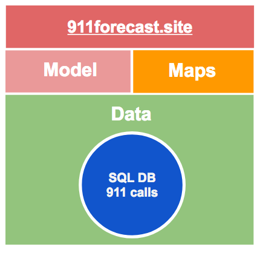
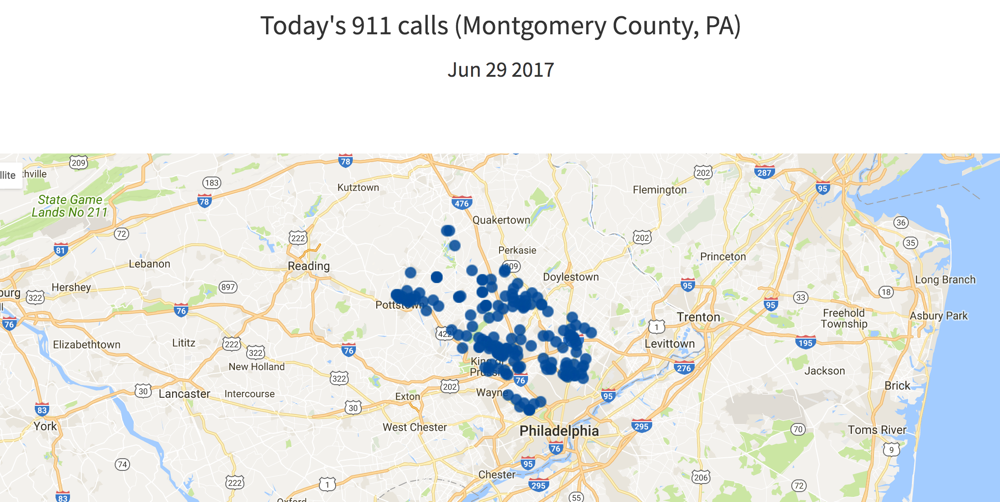
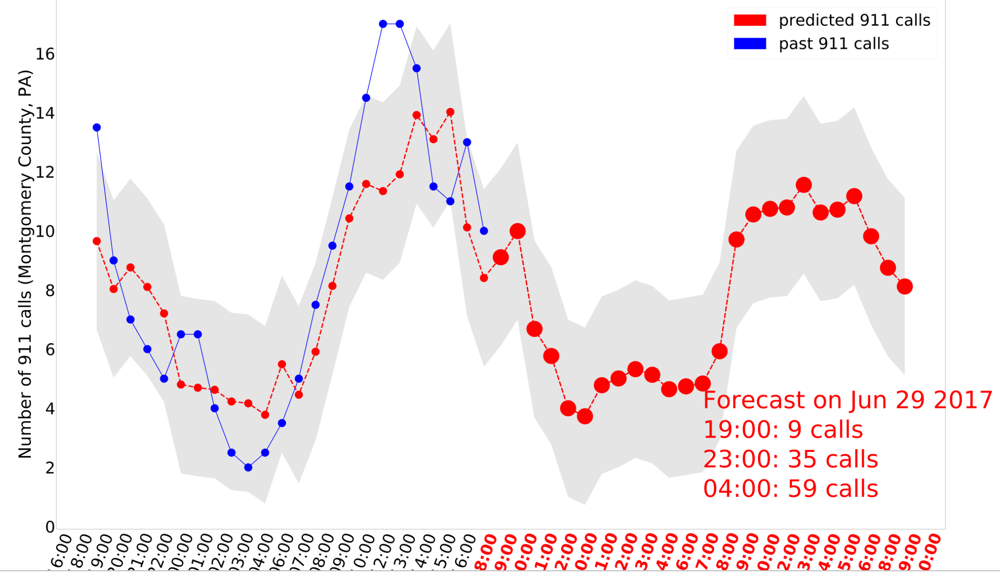
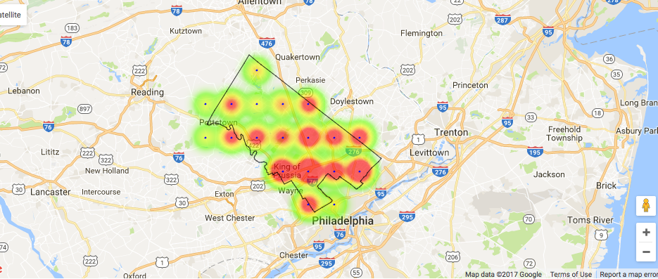

# [911 calls Forecast System](http://www.911forecast.site)
During my Insight Data Science project I developed an application to improve emergency response by forecasting 911 calls (http://www.911forecast.site). In particular I focused on medical emergency and used a dataset of 911 calls streamed in real-time from Montogmery Country, PA (http://montcoalert.org/gettingdata/)).

The time-series model was developed in python by using sklearn toolkit and included. A new GEO-Forecasting machine learning model is under implementation (see news below)

# System architecture

## [Data layer](emsmodule_data_exploration_2.ipynb)
This class develops the DB abstraction layer

## [Maps layer](emsmodule_maps.ipynb)
This class was developped to determine the spatial distribution of  911 calls and the Geo forecast probability distribution (new feature coming soon)

## [Model-training layer](emsmodule_forecast_training.ipynb)
This module contain the code that implements and trains the time-series forecast-model. GradientBoosting and linear Regression were used. A new class containing the GEO-Forcasting for this layer is under implementation

## [Model-forecast layer](emsmodule_forecast_future.ipynb)
This module contain the code that implements the hour and day forecasting

## [911forecast] <a href="http://www.911forecast.site">web app</a>
The web app was developped to create a  first functional version of the 911 forecast system

## [news]
A GEO-Forecasting model is under implementation

